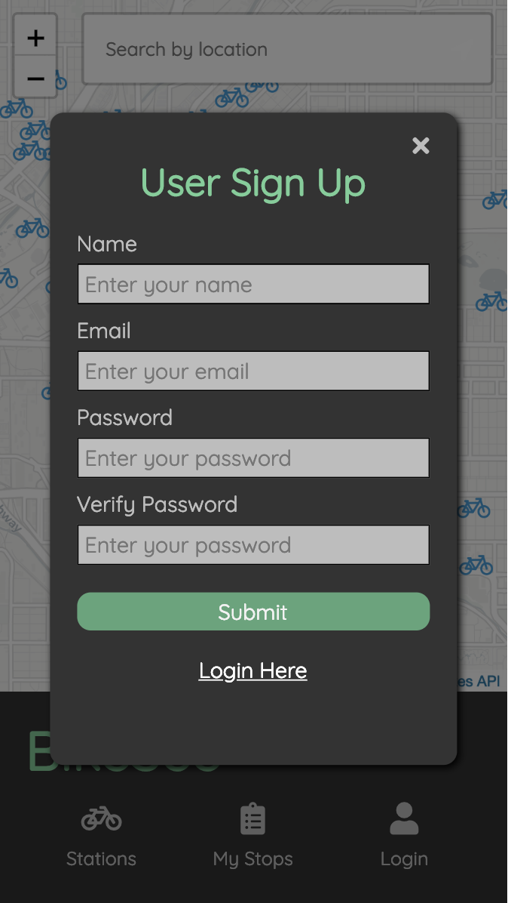
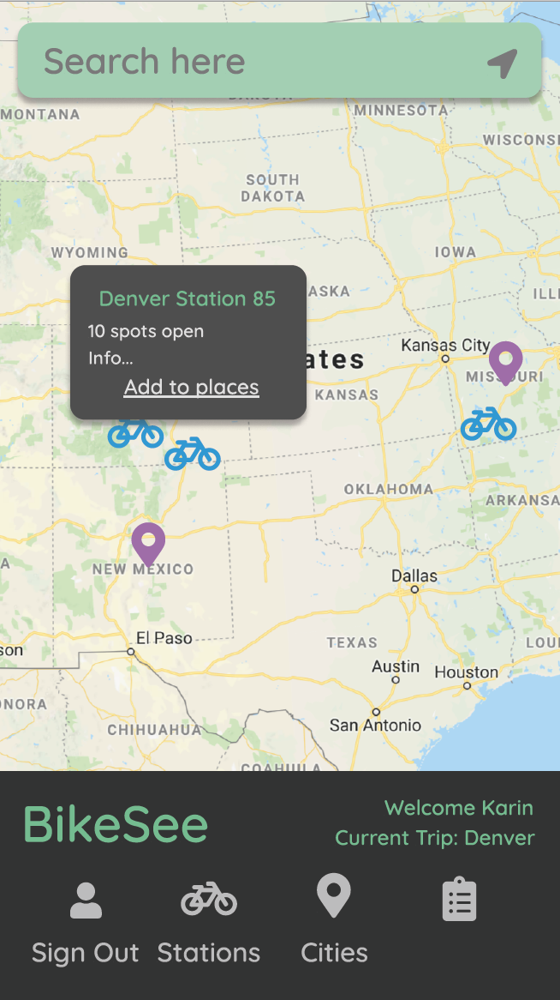
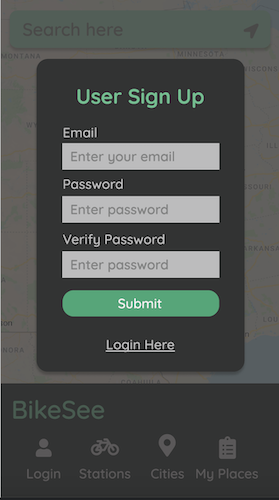

# bikeSee
#### A bike share sightseeing app for viewing bike share information around the world.

### Set-Up Back-End
Clone back-end repo: ```git clone https://github.com/kaohman/bike-see-server.git```
Run ```npm install``` from root directory
Run ```npm start```

### Set-Up Front-End
Clone this repo: ```git clone https://github.com/kaohman/bike-see.git```
Run ```npm install``` from root directory
Run ```npm start``` and visit localhost:3000 in your browser

### Deployed Website
Soon to come.

#### Background/About
This is an app for tourists who are interested in using bike shares in other cities. The interactive map displays bike share networks and stations around the world. Users can sign-up and login to add stations to my-stops and view a map of their stops. View original assigment [here](http://frontend.turing.io/projects/binary-challenge.html).

#### Screenshots
##### Overall page:


##### User sign up:


##### Map search:


### Primary Technologies Used
- ReactJS
- Redux
- React Router
- NodeJS
- Express
- Jest
- Enzyme
- SASS/SCSS
- CityBikes API

### Testing:
Jest and Enzyme for front-end testing.
Run npm test from the root directory

#### Enhancements
- Deploy website on Heroku
- Add backend database using MongoDB to store users.
- Include other landmarks on the interactive map.

### Contributors
[Karin Ohman](https://github.com/kaohman)

### Wireframes




